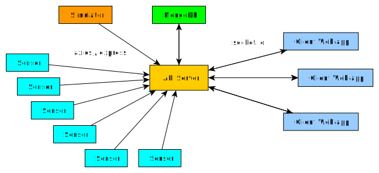

# lightcheck

Progect developed by Luca Di Liello for the IoT course at the University of Trento.

## Fast start

- Reach the main folder `lightcheck`

- Install all npm server libraries
```
npm install
```

- Install the npm client libraries
```
cd client
npm install
cd ..
```

- Start the express server with:
```
npm run start
```
wait until it is connected to the database.

- Launch the simulator with:
```
node simulator.js
```

- Start the client development server
```
cd client
npm run start
```

## Other utilities

- Reset the database:
```
node reset_db.js
```

- To change tile and osrm server for OpenStreetMaps, or to use a different database, edit the files `config.json` and `client/src/Config/config.json`
  - There is no guarantee that default tile and osrm servers will be always on.

- Enjoy 


# Documentation

## Introduction
LightCheck is a simple web-based application that allows to manage the street lamps of a given city. Given its modularity, it could be simply extended to manage all the services and public works, like gardens management, fountains, streets cleaning, etc...
The main interface is relatively simple but containts all the basic functionalities one should need. The api server is written in `nodejs` while the client uses the `React` technology. `MongoDB` is used as the main database.

## Statistics
The statistics panel shows some informations about the lamps and the number of active warehouses. The `working lamps` are those that are working normally, the `broken lamps` are those with a broken lightbulb while the `dead lamps` are those that are no longer reachable by the web-app. `broken lamps` usually requires the substitution of the lightbulb with a new one, while `dead lamps` may require a technician that will fix hardware or software problems with the sensors. 

## The main map
The main map is based on the OpenStreetMap service. At the beginning, it shows a map centered on a random warehouse. Like every map, it can be zoomed in and out, and moved in every direction. The app will draw lamps on the map to show their position and their status (working, broken, dead). Clicking on a lamp will open a small popup, containing a button that will do different actions based on the status of the system. 
The status of each lamp is updated immediately if the sensors around the city detect some change, for example if a lamp stops working. Thanks to the `socket.io` library, there is a persistent connection between the web-app and the server. At the moment, the sensors around the city are simulated by an other file called `simulator.js`. This small piece of software will make some random calls to the server, updating the status of each lamp after a casual amount of time. Then the update will be propagated to the client web-apps through the persistent connection.

## View option
The buttons contained in this small panel allow to hide/show only some lamps on the map, for example only the broken ones or only those that are working. Moreover, there is a button that allows to hide or show the routing legend that can be created by other panels.

## Lamp info
If you are not in `selection mode` (used by select the lamps to visit in `Generate a Trip` panel), this section will show the coordinates and the address of a lamp once it is selected on the map. The address may not always be showed, for example if a lamp does not match any known street.

## Generate a trip
This small interface is the most interesting of the project. What it basically does is to allow the user to select some lamps on the map and create a route that passes through all of them. The order of the lamps that has to be visited can be manually changed. Moreover, the route can be optimized to be as short as possible or to be a roundtrip from and to the warehouse. All this using the `Optimize` button. The `Auto Select` button can be used to automatically select all the broken or dead lamps.
Finally, clicking on `Set Route` the software will draw the path on the map and will print the directions in a small window. The button `Show/Hide Legend` in the `View Options` panel will show or hide this directions.

## Create calendar events
If you want to create an event to remember that a given list of lamps should be repaired, you can create an event on your calendar as a reminder. To do this, you should first login with your google account, clicking the `Login` button. After that, use the `Generate a trip` panel to create a route and set it on the map. Now set the starting date and time to choose when you want to start this small trip. The estimated time to fix a lamp will be used to compute the estimated duration of the trip (the length of the trip can be seen in the route legend). The web-app will use the data from the route on the map and from the estimated time to fix a lamp to compute the time needed to do the entire trip. 

# Structure of the project



## API Server

File `index.js`.

Launching this file will start an instance of an `express` server, that will be ready to receive updates from the sensors around the city and to serve the client web-app to the users. There will be a real-time connection between the web-apps and the API Server. The data from the sensors will be saved to the `MongoDB` database and sent to all the active web-app clients.

## Simulator

File `simulator.js`.

Will read a list of fake sensors from the file `positions.js` and start a simulation: every now and then it will call the API Server to transmit an update regarding the status of a street lamp. This process will continue forever, it should be stopped manually. A broken lamp will not be restored as working, nor a dead one.

## Reset the database

File `reset_db.js`.

Launch this file to clean the database and restart the simulation from scratch.

## Client web-app

The `client` folder contains an other `node` project. The entry point of the `React` project is the `src/Main/Main.js` file, that creates the main UI and contains all the other small panels, the map, the intestation and the footer. The list of lamps,that is rendered on the map, is part of the `state` of this React component. The real time connection with the API Server is responsible of keeping the lamp statuses up to date.

### Intestation and Footer
This two simple `React` components does nothing interesting, rendering only the title and some static informations on the page.

### Statistics
Using the information of the parent component `Main`, it shows some usefull informations about the lamps through `ProgressBar`s.

### Info
Shows the coordinated and the address of the actual selected lamp.

### Manage
Allow to show/hide lamps on the map based on their status.

### OpenMap
This component contains a `Leaflet.js` map and implements all the needed components to draw icons on the map, to create routes and to show copyright informations. The tile and routing servers used by default are the ones at `http://lucadiliello.ddns.net`, deployed on a Raspberry Pi B 3+.
The Routing components allow the creation of a layer that is inserted on top of the map and shows the selected route. As has been said before, edit the files `config.json` and `client/src/Config/config.json` to change the default server.

### Trips
This component is the one that allows the selection of some lamps on the map and the creation of a route that pass through all the selected lamps. The route in then drawn on the map as an additional layer. Moreover, it gives the possibility to select the best order at which lamps should be visited to be as efficient as possibile, basically trying to solve the TSP problem. The results on problems with more than 10 nodes may only be a good approximation of the global optimum.

### Markers
A component to draw small working, broken or dead lamps with different icons on the map, used by the `Trips` layer.

### Calendar
A component to add events to the calendar. It implements the login with a google account and the estimation of the time needed by an technician to visit all the lamps and fix the broken ones. The event is then added to the google calendar and, if needed, can be directly deleted from the web-app. This components is able to show the list of all events that a user has created.


# What technologies have been used ?
- `React`, `leafletjs`, `OpenStreetMap`, `Semantic UI React` and `Google Calendar APIs` to build the client web-app.
- `MongoDB` to create the database
- `Nodejs`, `Express` and `socket.io` to create the API server.
- `osrm-backend` to create my own routing server.
- `apache2`, `mod_tile` and `PostgreSQL` to create my own tile server of Merano, prov. Bolzano, Italy.

Usefull links:
- https://reactjs.org
- https://leafletjs.com
- https://www.openstreetmap.org/
- https://react.semantic-ui.com
- https://developers.google.com/calendar/
- https://www.mongodb.com
- https://nodejs.org/en/
- https://expressjs.com/it/
- https://socket.io
- https://github.com/Project-OSRM/osrm-backend
- https://httpd.apache.org
- https://github.com/openstreetmap/mod_tile
- https://www.postgresql.org